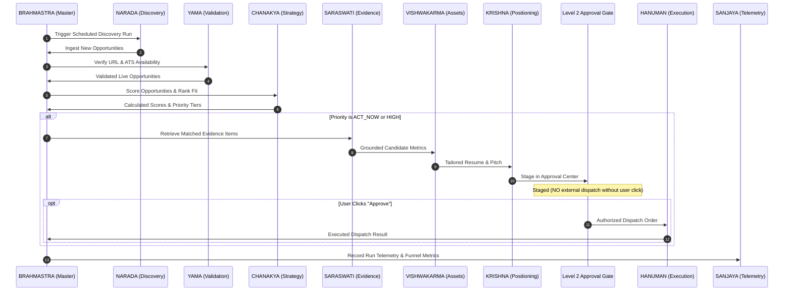

# JOBMUNI — Agent Architecture Specification

## 1. Internal Agent Taxonomy
JOBMUNI utilizes an internal multi-agent architecture where distinct specialized engines collaborate under the master orchestration protocol (**Brahmastra**).

> **Architectural Note**: These mythology-inspired names are strictly internal software concepts and engine abstractions. All user-facing interfaces present serious, minimal, enterprise-grade terminology (e.g. "Discovery Engine", "Opportunity Ranker", "Approval Gate").

---

## 2. Agent Responsibilities & Capabilities Matrix

| Internal Agent | Domain & Mission | Inputs | Outputs / Artifacts |
| :--- | :--- | :--- | :--- |
| **BRAHMASTRA** | Master Orchestration Protocol | System triggers, cron schedules, user events | Coordinated workflow executions, global error handling |
| **NARADA** | Information & Job Discovery | ATS APIs (Greenhouse/Lever), RSS, Web feeds | Unparsed raw job records, company entities |
| **YAMA** | Validation, Stale Detection & Rejection | Live job URLs, HTTP response headers, ATS status | Active flags, `is_ghost_job` flags, purge triggers |
| **CHANAKYA** | Strategy, Prioritization & Timing | Raw JDs, ScoringConfig weights, candidate profile | 0–100 match scores, priority tiers, Career GPS actions |
| **SARASWATI** | Knowledge & Evidence Bank | User work history, project achievements, metrics | Structured evidence records, skill taxonomy |
| **KUBERA** | Compensation & Financial Intelligence | Salary ranges, location tiers, cost-of-living data | Normalized comp estimates, compensation fit score |
| **ARJUNA** | Precision Targeting | Qualified high-priority jobs, recruiter directory | Optimal outreach path (ATS vs. Recruiter vs. Peer) |
| **KRISHNA** | Strategic Positioning & Communication | Job requirements + Evidence Bank items | Tailored outreach drafts, positioning angles |
| **VISHWAKARMA** | Application Asset Generation | Candidate profile + Target JD + Evidence items | Tailored resume markdown, custom cover letters |
| **HANUMAN** | Execution Workflows | Approved items from the Approval Center | Dispatched emails (Gmail/SMTP), webhook posts |
| **GARUDA** | High-Speed Routing & Delivery | Outgoing messages, Google Sheets sync queue | Sheet row updates, instant mobile notification events |
| **SANJAYA** | Situation Awareness & Reporting | Pipeline changes, interview outcomes, errors | Daily summary reports, conversion funnel telemetry |

---

## 3. Inter-Agent Interaction Workflow

---

## 4. Agent Invariants & Behavioral Boundaries

1. **Zero Hallucination Mandate**: VISHWAKARMA and KRISHNA may **only** reference facts, companies, metrics, and dates present in SARASWATI (the Evidence Bank). No invented achievements.
2. **Strict Non-Autonomous External Dispatch**: HANUMAN is programmatically blocked from executing any network call to external recruiters or ATS platforms unless an explicit `APPROVED` record signed with a user timestamp exists in the database.
3. **Graceful Degeneration**: If any sub-agent encounters an error (e.g. rate limit on an ATS feed), BRAHMASTRA isolates the failure, logs full telemetry through SANJAYA, and continues executing unrelated agent tasks.
