# JOBMUNI — System Architecture Specification

## 1. System Identity & Mission
**JOBMUNI** is an Autonomous Career Intelligence & Execution Operating System designed for senior professionals. It continuously discovers, validates, evaluates, and prioritizes career opportunities, strategizes outreach paths, and assists the user in executing high-impact career actions under strict human-in-the-loop autonomy constraints.

---

## 2. Core Architecture Invariants

1. **Cloud-First Persistence**: PostgreSQL is the authoritative production source of truth. SQLite (WAL mode) is maintained strictly for local development and offline caching.
2. **24/7 Autonomous Background Processing**: The automation worker runs as an independent OS service / container daemon, completely decoupled from the frontend web server, user devices, and Antigravity IDE. Background intelligence pipelines continue executing when the user's laptop is powered off and phone is locked.
3. **Google Sheets as an Operational Cockpit**: Google Sheets serves as a bidirectional synchronization adapter and mobile-friendly control surface. It is **never** the primary database.
4. **Zero-Hallucination Evidence Bank**: Generative AI components are strictly grounded by the candidate's verified Evidence Bank. AI is forbidden from inventing employment history, skills, metrics, certifications, or achievements.
5. **Autonomy Guard Level 2**: No outbound communication, email dispatch, or job application submission is ever performed without explicit human approval via the Approval Center. Blind mass auto-apply is strictly prohibited.
6. **Polite, Ethical Discovery**: Job discovery prioritizes official ATS APIs (Greenhouse, Lever, Workday), public feeds, and official company endpoints. Strict compliance with rate limits, robots.txt, and access controls. No CAPTCHA bypassing, no unauthorized scraping behind login walls.

---

## 3. High-Level System Architecture Diagram

```mermaid
graph TB
    subgraph "External Ecosystem"
        ATS[Official ATS Endpoints & Public Feeds<br/>Greenhouse / Lever / Workday / RSS]
        GoogleWorkspace[Google Workspace<br/>Sheets API / Gmail OAuth / Drive API]
        AIGateway[Provider-Agnostic AI Gateway<br/>Anthropic Claude / OpenAI / Gemini / Local Fallback]
    end

    subgraph "JOBMUNI Core Runtime (24/7 Cloud Host)"
        subgraph "Independent Background Worker (Brahmastra Engine)"
            Narada[NARADA<br/>Discovery Agent]
            Yama[YAMA<br/>Validation & Stale Detection]
            Chanakya[CHANAKYA<br/>Scoring & Prioritization]
            Kubera[KUBERA<br/>Comp & Market Intel]
            Arjuna[ARJUNA<br/>Precision Targeter]
            Krishna[KRISHNA<br/>Positioning & Comms]
            Vishwakarma[VISHWAKARMA<br/>Asset Generator]
            Hanuman[HANUMAN<br/>Workflow Execution]
            Sanjaya[SANJAYA<br/>Reporting & Telemetry]
            Saraswati[SARASWATI<br/>Evidence Bank & Knowledge]
        end

        subgraph "Backend Application (FastAPI Gateway)"
            APIRouter[FastAPI v1 REST / Webhooks]
            AuthMiddleware[Security & Auth Middleware]
            ScoringService[Dynamic Scoring Engine]
            ApprovalEngine[Level 2 Approval State Machine]
            SyncEngine[Bidirectional Google Sheets Sync]
            AuditService[Structured Observability & Telemetry]
        end

        subgraph "Persistence Layer"
            PostgresDB[(Production PostgreSQL 16+<br/>Authoritative Source of Truth)]
            SQLiteDev[(Local Dev SQLite WAL)]
        end
    end

    subgraph "Client Presentation Layer"
        NextJS[JOBMUNI Web App & PWA<br/>Next.js 14 App Router + Tailwind + TypeScript]
        MobilePWA[Mobile Viewport<br/>320px / 375px / 390px PWA]
        SheetsUI[Google Sheets Operational Surface<br/>Bidirectional Sync Adapter]
    end

    %% Connections
    ATS --> Narada
    ATS --> Yama
    Narada --> PostgresDB
    Yama --> PostgresDB
    Chanakya --> PostgresDB
    Krishna --> AIGateway
    Vishwakarma --> AIGateway
    Saraswati --> PostgresDB

    APIRouter --> PostgresDB
    APIRouter --> SQLiteDev
    SyncEngine <--> GoogleWorkspace
    Hanuman --> GoogleWorkspace

    NextJS <--> APIRouter
    MobilePWA <--> APIRouter
    GoogleWorkspace <--> SheetsUI
```



---

## 4. Subsystem Topology & Technology Stack

| Layer | Technology | Primary Function & Production Role |
| :--- | :--- | :--- |
| **Frontend Web & PWA** | Next.js 14 (App Router), TypeScript, Tailwind CSS, Lucide, Radix UI, Recharts | Executive command center, real-time telemetry, human-in-the-loop approval center, responsive from 320px mobile to 1920px desktop. |
| **API Gateway** | FastAPI, Python 3.11+, Pydantic v2, Uvicorn / Gunicorn | High-performance async REST API, schema validation, webhook ingress, and approval gatekeeper. |
| **Database ORM & Migrations** | SQLAlchemy 2.0 (Async), Alembic, AsyncPG / AioSQLite | Multi-dialect persistence with unified schema, automated migrations, connection pooling, and optimistic locking. |
| **Primary Persistence** | PostgreSQL 16+ (Production), SQLite with WAL (Local Dev) | Complete relational persistence across 16 core entities: jobs, applications, recruiters, interviews, evidence bank, telemetry. |
| **Background Processing** | Independent Python Worker Daemon (Brahmastra Engine) | Asynchronous 24/7 scheduler, cron triggers, feed polling, stale job pruner, health heartbeats. Runs independently of user devices. |
| **External Integration** | Google Workspace APIs (Sheets, Gmail, Drive) | Bidirectional operational mirror to Google Sheets, authorized email drafts, and asset storage. |
| **AI Gateway** | Provider-Agnostic AI Client with Deterministic Evidence Grounding | Contextual resume tailoring, JD requirement extraction, interview intelligence, and cover letter synthesis. |
| **Test & QA Framework** | Pytest, Pytest-Asyncio, Playwright E2E | Deterministic test automation across backend services, database migrations, responsive viewports, and approval state machines. |

---

## 5. Continuous 24/7 Decoupled Execution Model

```
User Closes Laptop / Phone Locks
                │
                ▼
┌───────────────────────────────────────────────────────────┐
│ Cloud Server / Docker Container Daemon (24/7 Continuous) │
│                                                           │
│  [Cron Schedule / Event Loop]                             │
│       │                                                   │
│       ├─► NARADA polls official job feeds & ATS APIs      │
│       ├─► YAMA validates active listings & flags ghosts   │
│       ├─► CHANAKYA scores fit & updates Career GPS        │
│       ├─► KUBERA computes comp benchmark differentials   │
│       ├─► SANJAYA generates daily telemetry & metrics     │
│       └─► SYNC ENGINE pushes delta to Google Sheets       │
│                                                           │
│  [PostgreSQL State Updated]                               │
└─────────────────────────────┬─────────────────────────────┘
                              │
User Reopens Mobile PWA / Browser
                │
                ▼
┌───────────────────────────────────────────────────────────┐
│ Immediate Updated State Loaded from PostgreSQL            │
│ - New high-urgency jobs waiting in Job Radar              │
│ - Zero pending approvals dispatched without human click   │
│ - Fresh Career GPS top recommended action displayed       │
└───────────────────────────────────────────────────────────┘
```
