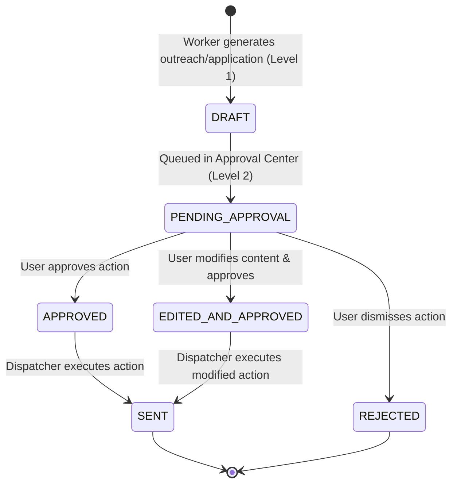

# Kavish Career OS — Autonomy Policy & Approval Guardrails

## 1. Autonomy Level Framework

Kavish Career OS enforces strict autonomy boundaries to ensure background efficiency while eliminating any risk of unauthorized external communication or data destruction.

```
┌─────────────────────────────────────────────────────────────┐
│ LEVEL 0: FULLY AUTONOMOUS (Background Workers & Schedulers)  │
│ - Job discovery from public feeds & connectors              │
│ - Deduplication & canonical URL resolution                  │
│ - Freshness verification & HTTP health checks               │
│ - Hiring signal & opportunity fit scoring                   │
│ - Career GPS action prioritization                          │
│ - Inbound reply classification & funnel analytics           │
└─────────────────────────────────────────────────────────────┘
                              │
                              ▼
┌─────────────────────────────────────────────────────────────┐
│ LEVEL 1: AUTOMATIC PREPARATION (AI & Generation Engine)     │
│ - Tailored resume bullet drafting from Evidence Bank        │
│ - Cover letter & cold email sequence generation             │
│ - Follow-up message preparation (+3d, +7d, +14d)            │
│ - Interview question preparation & STAR answer framing      │
└─────────────────────────────────────────────────────────────┘
                              │
                              ▼
┌─────────────────────────────────────────────────────────────┐
│ LEVEL 2: HUMAN APPROVAL REQUIRED (Approval Center Gate)     │
│ - Dispatching recruiter cold emails or follow-ups           │
│ - Submitting official job applications                      │
│ - Sending referral or networking requests                   │
│ - Any external, irreversible outbound communication        │
└─────────────────────────────────────────────────────────────┘
                              │
                              ▼
┌─────────────────────────────────────────────────────────────┐
│ LEVEL 3: PROHIBITED / NEVER AUTONOMOUS                      │
│ - Financial or payment transactions                         │
│ - Credential modifications or OAuth re-authorizations       │
│ - Irreversible data deletion (DROP TABLE, mass purge)       │
└─────────────────────────────────────────────────────────────┘
```

---

## 2. Approval Center Architecture & State Machine



### Approval Record Metadata
Every pending action displays:
1. **Action Intent**: What external action will take place (e.g. `SEND_EMAIL_SMTP`).
2. **Context & Target**: Recruiter Name, Role, Company, and Job Link.
3. **Trigger Rationale**: Why the system recommends this action now.
4. **Draft Payload**: Full subject, body, and attachments.
5. **Evidence Provenance**: Specific Evidence Bank items used to build the draft.
6. **Actions**: `Approve Now`, `Edit & Send`, `Reject`.
