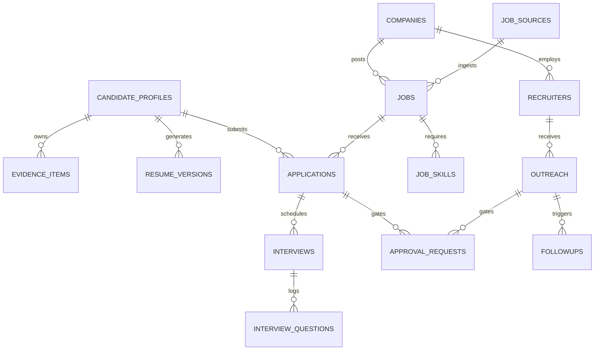

# JOBMUNI — Data Model Specification

## 1. Database Overview & Dialects
- **Authoritative Production Database**: PostgreSQL 16+ with UUIDs, JSONB, and B-Tree / GIN indexing.
- **Local Development Database**: SQLite 3 with WAL mode enabled (`PRAGMA journal_mode=WAL;`).
- **ORM & Migrations**: SQLAlchemy 2.0 (Async) + Alembic.

---

## 2. Entity-Relationship Overview

---

## 3. Core Entity Schemas

### 1. `candidate_profiles`
| Field | Type | Modifiers | Description |
| :--- | :--- | :--- | :--- |
| `id` | `VARCHAR(36)` / `UUID` | Primary Key | Unique profile ID |
| `full_name` | `VARCHAR(255)` | Not Null | Candidate full name |
| `target_title` | `VARCHAR(255)` | Not Null | Target seniority & title (e.g. Lead BI Engineer) |
| `min_base_salary` | `INTEGER` | Nullable | Minimum acceptable base compensation ($) |
| `target_base_salary` | `INTEGER` | Nullable | Target base compensation ($) |
| `preferred_locations` | `JSON` / `JSONB` | Default `[]` | List of target cities/regions |
| `remote_preference` | `VARCHAR(50)` | Default `'REMOTE_PREFERRED'` | `REMOTE_ONLY`, `HYBRID`, `ANY` |
| `created_at` / `updated_at`| `TIMESTAMP` | Not Null | Audit timestamps |

### 2. `evidence_items` (Evidence Bank)
| Field | Type | Modifiers | Description |
| :--- | :--- | :--- | :--- |
| `id` | `VARCHAR(36)` / `UUID` | Primary Key | Unique evidence item ID |
| `candidate_id` | `VARCHAR(36)` | Foreign Key | Owner candidate profile |
| `category` | `VARCHAR(100)` | Not Null | `PROJECT`, `ACHIEVEMENT`, `LEADERSHIP`, `CERT` |
| `headline` | `VARCHAR(255)` | Not Null | High-impact summary (e.g., Snowflake Warehouse Migration) |
| `metrics_raw` | `VARCHAR(255)` | Not Null | Quantified metric (e.g. 40% query latency reduction, $1.2M saved) |
| `situation` | `TEXT` | Not Null | Context and business challenge |
| `action` | `TEXT` | Not Null | Technical decisions and architectural actions |
| `result` | `TEXT` | Not Null | Measured business impact |
| `technologies_used`| `JSON` / `JSONB` | Default `[]` | Array of tech tags (`["Snowflake", "dbt", "Airflow"]`) |
| `verified_date` | `DATE` | Not Null | Date of achievement |

### 3. `jobs` (Opportunity Radar)
| Field | Type | Modifiers | Description |
| :--- | :--- | :--- | :--- |
| `id` | `VARCHAR(36)` / `UUID` | Primary Key | Unique job ID |
| `company_id` | `VARCHAR(36)` | Foreign Key | Linked company entity |
| `source_id` | `VARCHAR(36)` | Foreign Key | Ingest source (ATS, Feed, Manual) |
| `title` | `VARCHAR(255)` | Not Null | Job title |
| `raw_description` | `TEXT` | Not Null | Complete unedited JD text |
| `location` | `VARCHAR(255)` | Nullable | Location string |
| `remote_status` | `VARCHAR(50)` | Default `'UNKNOWN'` | `REMOTE`, `HYBRID`, `ON_SITE` |
| `salary_min` / `max` | `INTEGER` | Nullable | Disclosed or estimated compensation |
| `currency` | `VARCHAR(10)` | Default `'USD'` | Compensation currency |
| `posting_url` | `TEXT` | Nullable | Direct URL to live job posting |
| `posted_at` | `TIMESTAMP` | Nullable | Original job posted date |
| `first_seen_at` | `TIMESTAMP` | Default `now()` | Date first discovered by JOBMUNI |
| `last_verified_at` | `TIMESTAMP` | Default `now()` | Last time posting was verified live |
| `is_active` | `BOOLEAN` | Default `True` | Live vs. closed status |
| `is_ghost_job` | `BOOLEAN` | Default `False` | Flagged as stale/unresponsive listing |
| `match_score` | `FLOAT` | Default `0.0` | Algorithmic alignment score (0–100) |
| `priority_tier` | `VARCHAR(50)` | Default `'MEDIUM'` | `ACT_NOW`, `HIGH`, `MEDIUM`, `NURTURE`, `IGNORE` |
| `score_breakdown` | `JSON` / `JSONB` | Default `{}` | Detailed 7-dimensional score breakdown |

### 4. `companies`
| Field | Type | Modifiers | Description |
| :--- | :--- | :--- | :--- |
| `id` | `VARCHAR(36)` / `UUID` | Primary Key | Unique company ID |
| `name` | `VARCHAR(255)` | Not Null, Unique | Company name |
| `domain` | `VARCHAR(255)` | Nullable | Website domain (e.g. `snowflake.com`) |
| `ats_provider` | `VARCHAR(100)` | Nullable | `GREENHOUSE`, `LEVER`, `WORKDAY`, `ASHBY` |
| `hiring_signal_tier`| `VARCHAR(50)`| Default `'TIER_3'` | `TIER_1` (Aggressive), `TIER_2`, `TIER_3`, `TIER_4` |
| `is_target_company`| `BOOLEAN` | Default `False` | High-priority dream company flag |

### 5. `recruiters`
| Field | Type | Modifiers | Description |
| :--- | :--- | :--- | :--- |
| `id` | `VARCHAR(36)` / `UUID` | Primary Key | Unique recruiter ID |
| `company_id` | `VARCHAR(36)` | Foreign Key | Linked company |
| `full_name` | `VARCHAR(255)` | Not Null | Recruiter name |
| `role_title` | `VARCHAR(255)` | Nullable | Job title (e.g., Senior Technical Recruiter) |
| `email` | `VARCHAR(255)` | Nullable | Verified contact email |
| `linkedin_url` | `TEXT` | Nullable | LinkedIn profile URL |
| `outreach_status` | `VARCHAR(50)` | Default `'NOT_CONTACTED'` | `NOT_CONTACTED`, `STAGED`, `SENT`, `REPLIED` |
| `last_contacted_at`| `TIMESTAMP` | Nullable | Last outreach timestamp |

### 6. `applications`
| Field | Type | Modifiers | Description |
| :--- | :--- | :--- | :--- |
| `id` | `VARCHAR(36)` / `UUID` | Primary Key | Unique application ID |
| `job_id` | `VARCHAR(36)` | Foreign Key | Linked job |
| `candidate_id` | `VARCHAR(36)` | Foreign Key | Applicant profile |
| `status` | `VARCHAR(50)` | Default `'IDENTIFIED'` | `IDENTIFIED`, `DRAFTING`, `APPROVED`, `SUBMITTED`, `SCREENING`, `INTERVIEWING`, `OFFER`, `REJECTED`, `WITHDRAWN` |
| `resume_version_id`| `VARCHAR(36)`| Nullable | Attached tailored resume |
| `cover_letter_text`| `TEXT` | Nullable | Attached tailored cover letter |
| `applied_at` | `TIMESTAMP` | Nullable | Application submission timestamp |

### 7. `approval_requests` (Level 2 Autonomy Gate)
| Field | Type | Modifiers | Description |
| :--- | :--- | :--- | :--- |
| `id` | `VARCHAR(36)` / `UUID` | Primary Key | Unique approval ID |
| `action_type` | `VARCHAR(100)` | Not Null | `SEND_OUTREACH_EMAIL`, `SUBMIT_APPLICATION`, `SEND_FOLLOWUP` |
| `status` | `VARCHAR(50)` | Default `'PENDING'` | `PENDING`, `APPROVED`, `REJECTED`, `DISPATCHED` |
| `payload` | `JSON` / `JSONB` | Not Null | Full dispatch details (to, subject, body, attachments) |
| `recipient` | `VARCHAR(255)` | Not Null | Target email / URL |
| `decided_at` | `TIMESTAMP` | Nullable | When the user approved or rejected |
| `decision_notes` | `TEXT` | Nullable | User-entered feedback or rejection reason |

### 8. `scoring_configs`
| Field | Type | Modifiers | Description |
| :--- | :--- | :--- | :--- |
| `id` | `VARCHAR(36)` / `UUID` | Primary Key | Unique config ID |
| `weight_skill_fit` | `FLOAT` | Default `0.25` | Weight for SQL, Snowflake, dbt, Looker (25%) |
| `weight_seniority_fit`| `FLOAT` | Default `0.15` | Seniority & Title alignment (15%) |
| `weight_domain_fit` | `FLOAT` | Default `0.15` | BI & Analytics domain focus (15%) |
| `weight_comp_fit` | `FLOAT` | Default `0.15` | Compensation fit (15%) |
| `weight_freshness` | `FLOAT` | Default `0.10` | Freshness <48h (10%) |
| `weight_hiring_signal`| `FLOAT`| Default `0.10` | Active vs. Ghost hiring signal (10%) |
| `weight_recruiter_presence`| `FLOAT`| Default `0.10`| Recruiter reachability (10%) |
| `is_active` | `BOOLEAN` | Default `True` | Active config flag |

### 9. `automation_runs` (Observability & Telemetry)
| Field | Type | Modifiers | Description |
| :--- | :--- | :--- | :--- |
| `id` | `VARCHAR(36)` / `UUID` | Primary Key | Unique run ID |
| `agent_name` | `VARCHAR(100)` | Not Null | `NARADA`, `YAMA`, `CHANAKYA`, etc. |
| `action` | `VARCHAR(255)` | Not Null | Description of action executed |
| `source` | `VARCHAR(255)` | Nullable | Data source or target entity |
| `status` | `VARCHAR(50)` | Not Null | `SUCCESS`, `FAILURE`, `RUNNING`, `SKIPPED` |
| `duration_ms` | `INTEGER` | Default `0` | Execution duration in ms |
| `error_message` | `TEXT` | Nullable | Full error message on failure |
| `retry_count` | `INTEGER` | Default `0` | Retry attempts |
| `created_at` | `TIMESTAMP` | Default `now()` | Execution start timestamp |
