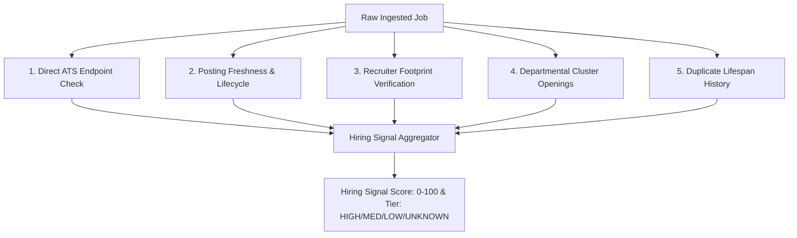

# Kavish Career OS — Hiring Signal Engine Specification

## 1. Objective & Purpose
The **Hiring Signal Engine** eliminates wasted effort on "ghost jobs", compliance postings, and defunct roles by calculating a real, evidence-backed **Hiring Signal Score (0-100)** and confidence tier (`HIGH`, `MEDIUM`, `LOW`, `UNKNOWN`).

---

## 2. Signal Evaluation Criteria

### Signal Factors & Weights:
1. **Direct ATS Endpoint Health (30%)**:
   - Live HTTP 200 on Greenhouse, Lever, Ashby, Workday URL with active application form.
2. **Posting Freshness (25%)**:
   - Posted $<7\text{ days}$: 100 pts.
   - Posted $8-21\text{ days}$: 75 pts.
   - Posted $>30\text{ days}$: 30 pts.
   - Posted $>60\text{ days}$: 0 pts (Probable evergreen / stale).
3. **Identifiable Active Recruiter / Hiring Manager (20%)**:
   - Recruiter linked to company and actively sourcing for Data/BI roles on LinkedIn.
4. **Departmental Cluster Openings (15%)**:
   - Company has $>2$ complementary openings (e.g. Data Engineer + Analytics Engineer + BI Lead), confirming active data team expansion.
5. **Deduplication History (10%)**:
   - Role was not repeatedly reposted every 30 days without changes over 6+ months.

---

## 3. Tier Classifications
- **`HIGH` ($\ge 75$)**: Active, urgent requirement with direct verified ATS endpoint and recent posting date.
- **`MEDIUM` ($50 - 74$)**: Legitimate role, but $>21$ days old or lacking direct recruiter association.
- **`LOW` ($< 50$)**: Likely evergreen, passive collection, or stale.
- **`UNKNOWN`**: Ingestion source lacks date or endpoint verification data.
