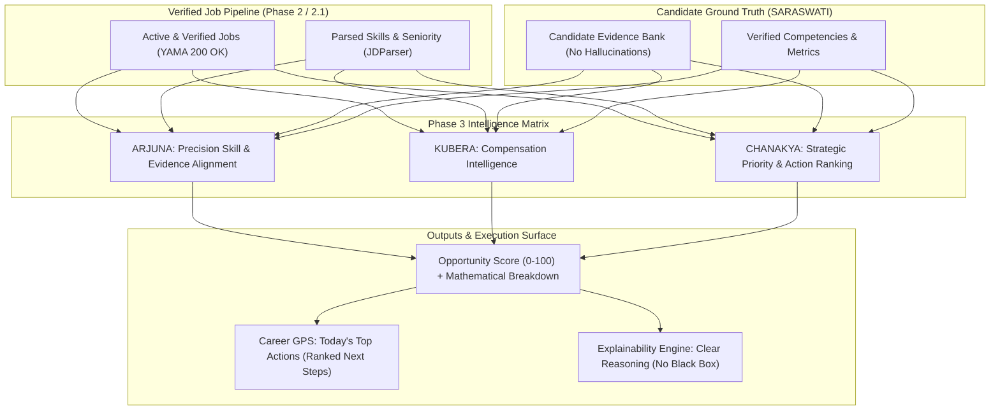

# JOBMUNI — Phase 3 Architecture: Evidence-Grounded Career Intelligence

## 1. System Overview & Mission

Phase 3 transforms verified job opportunities (discovered by **NARADA** and validated by **YAMA**) into transparent, deterministic, and evidence-grounded career intelligence.

---

## 2. Core Architectural Tenets

1. **Zero Hallucination Guarantee (Saraswati Protocol)**:
   - AI models must NEVER invent candidate skills, achievements, projects, companies, certifications, or salary histories.
   - Every skill match and application claim must point to a concrete `EvidenceItem` ID in the Evidence Bank with quantifiable metrics.
2. **Transparent, Multi-Dimensional Scoring (No Fake ATS Scores)**:
   - Scoring is a deterministic weighted composite of 7 explicit dimensions:
     1. Required Skill Coverage ($W_1$)
     2. Preferred Skill Coverage ($W_2$)
     3. Evidence Density & Depth ($W_3$)
     4. Seniority & Title Alignment ($W_4$)
     5. Compensation & Remote/Location Fit ($W_5$)
     6. Hiring Signal & Urgency ($W_6$)
     7. Freshness & Active State ($W_7$)
   - Every score is accompanied by a mathematical breakdown: `score_breakdown` JSON.
3. **Actionable Explainability**:
   - Every recommended opportunity exposes:
     - **Strengths**: Specific verified skills matching the JD.
     - **Gaps / Cautions**: Missing skills or unverified requirements.
     - **Why Act Now**: Urgency signals, hiring speed, and comp fit.
4. **Autonomous Level 2 Safety (No Auto-Apply)**:
   - Recommendations and tailored assets are prepared for human approval. No automated external transmissions or silent submissions.

---

## 3. Component Architecture & Agent Matrix

| Agent / Engine | Domain | Input | Output |
| :--- | :--- | :--- | :--- |
| **SARASWATI** | Evidence Custodian | Candidate experiences, STAR bullets, metrics | Structured evidence records with confidence weights |
| **ARJUNA** | Precision Alignment | Job requirements vs. Evidence items | Required % match, Preferred % match, Evidence coverage % |
| **KUBERA** | Compensation Intel | Job salary min/max vs. Candidate target | Comp score, percentile delta, compensation tier |
| **CHANAKYA** | Strategy & Prioritization | Combined fit + hiring signals + freshness | Priority tier (`ACT_NOW`, `HIGH`, `MEDIUM`, `NURTURE`, `IGNORE`) |
| **CAREER GPS** | Actionable Synthesis | Top priority active opportunities | Daily Top Actions with concrete next steps |
| **EXPLAINABILITY** | Transparency | Scoring vectors & gap analysis | Plain-English rationale and risk analysis |

---

## 4. Integration with Phase 1, Phase 2, & Phase 2.1

- **Phase 1 Application Foundation**: Leverages FastAPI endpoints, Next.js dashboard UI, and Pydantic schemas.
- **Phase 2 & 2.1 Discovery & Verification**: Operates exclusively on jobs that have passed YAMA reachability verification (`verification_status == 'ACTIVE'` and `verification_reason == 'EXACT_JOB_FOUND'`).
- **Worker Process Integration**: The standalone 24/7 worker runs the Phase 3 scoring and GPS action ranking as part of its scheduled cycle.
