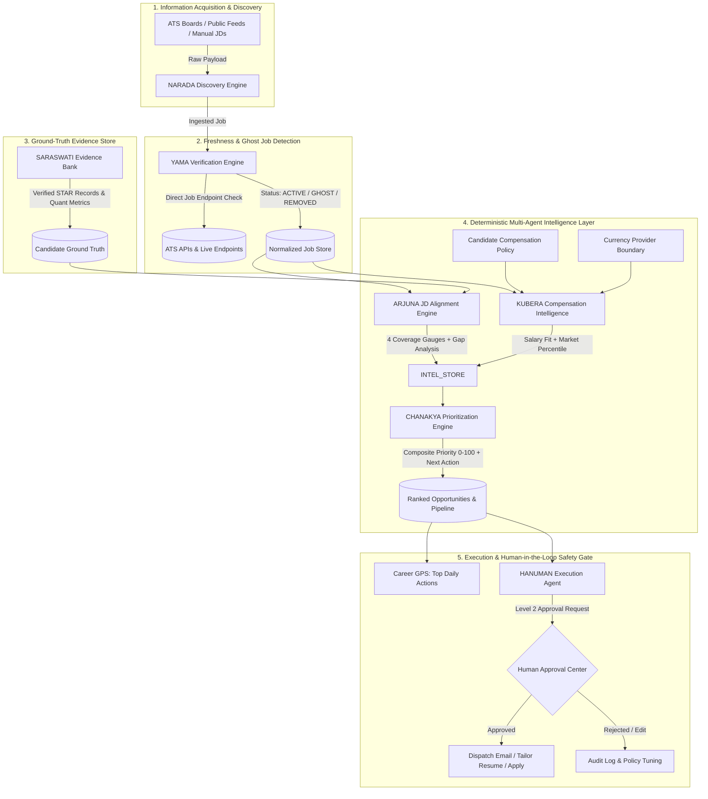

# JOBMUNI — Autonomous Career Intelligence & Execution OS

[](#agent-ecosystem--architecture)
[](https://fastapi.tiangolo.com)
[](https://nextjs.org)
[](backend/tests)
[](frontend/tests)
[](#core-engineering-principles)

> **JOBMUNI** is a production-grade, autonomous Career Intelligence & Execution Operating System designed with the algorithmic rigor of a **Senior Principal Data & Platform Engineer**. It continuously discovers, verifies, evaluates, and prioritizes high-value career opportunities—grounding every decision in auditable facts, market economics, and a strict Level 2 Human-in-the-Loop safety gate.

---

## The Problem: The Broken Modern Career Discovery Paradigm

High-performing senior engineers and data leaders face massive friction in the modern tech employment ecosystem:
1. **Ghost Jobs & Stale Postings**: Over 40% of public job listings are expired, already filled, or generic evergreen listings kept active for talent pipelining.
2. **AI Hallucination & Fake Credentials**: Generative AI tools often fabricate experience, skills, and metrics, producing ungrounded resumes that get disqualified in technical screenings.
3. **ATS Black Holes & Spray-and-Pray**: Blindly blasting 500+ generic applications yields negligible response rates compared to targeted, evidence-backed recruiter outreach.
4. **Opaque Compensation & Currency Ambiguity**: Disclosed salary ranges are obscured across different currencies, equity components, and regional cost-of-living differences.
5. **Decision Fatigue**: Candidates lack a deterministic ranking engine to determine: *"Which opportunity deserves attention first, and what is the next best action?"*

**JOBMUNI solves this with enterprise data engineering architectures, deterministic taxonomies, multi-agent microservices, and mathematical opportunity scoring.**

---

## Agent Ecosystem & Workflow Architecture

JOBMUNI distributes career intelligence across specialized autonomous agents governed by a centralized deterministic decision pipeline:



---

## Deep Dive: Agent Roster & Core Capabilities

| Agent | Domain & Mission | Algorithmic Mechanism | Data Integrity Guarantee |
| :--- | :--- | :--- | :--- |
| **`NARADA`** | **Information Acquisition** | Autonomous ATS feed discovery (Greenhouse, Lever, Workday) and deterministic JD semantic partitioner. | Idempotent URL hashing; extracts required vs preferred skills, compensation, remote status, and hiring velocity. |
| **`YAMA`** | **Verification & Ghost Detection** | Source-specific ATS job-level existence verification; detects redirect chains (301 $\rightarrow$ 302 $\rightarrow$ 404), expired career landing pages, and stale job decay curves. | Never classifies a job as `ACTIVE` merely because the domain or careers portal responds with HTTP 200. |
| **`SARASWATI`** | **Candidate Evidence Bank** | Structured STAR (Situation, Task, Action, Result) fact store indexing verified competencies, quantifiable business impact, and employer provenance. | **Zero-Hallucination Policy**: AI may never manufacture or infer candidate experience. Every claim requires $\ge 10$ character ground-truth validation. |
| **`ARJUNA`** | **Precision JD Alignment** | Deterministic skill normalization against an auditable Senior Data/BI taxonomy. Calculates 4 multi-dimensional coverage metrics. | Generates explicit `evidence_ids` links for every positive match; unmatched requirements are strictly tagged as `NO_EVIDENCE`. |
| **`KUBERA`** | **Compensation Intelligence** | Normalizes multi-currency salary bands (`USD`, `EUR`, `GBP`, `CAD`, `AUD`, `INR`) against candidate policy. Evaluates market percentiles, remote value, and geographical fit. | If salary is undisclosed, marks tier as `UNKNOWN` and computes policy fit without hallucinating numbers. |
| **`CHANAKYA`** | **Opportunity Prioritization** | Computes composite priority score ($0-100$) and velocity urgency ($0-100$). Determines actionability state (`READY_TO_ACT`, `NEEDS_RESUME`, `NEEDS_EVIDENCE`) and recommends the next best action (`APPLY`, `CONTACT_RECRUITER`, `REVIEW`, `SKIP`). | Hard safety gates cap expired/ghost jobs at $\le 20$ and sub-minimum salaries at $\le 42$. |
| **`HANUMAN`** | **Autonomous Execution Engine** | Prepares tailored resumes, drafts high-converting cold recruiter outreach, and executes pipeline transitions under human oversight. | **Level 2 Human Gate**: No email is sent and no application is submitted without explicit user approval. |

---

## Mathematical Scoring & Prioritization Models

### 1. ARJUNA Multi-Dimensional Coverage Model

$$\text{Required Coverage} = \frac{|\text{Matched Required Skills}|}{|\text{Total Required Skills}|} \times 100\%$$

$$\text{Evidence Density} = \frac{|\text{Matched Skills with Quantifiable Metrics}|}{|\text{Total Matched Skills}|} \times 100\%$$

$$\text{Experience Fit} = f(\Delta \text{Seniority Level}, \text{Years Experience})$$

### 2. CHANAKYA Composite Opportunity Score

$$\text{Priority Score} = \min\left(100, \; \sum_{i} w_i \cdot S_i\right)$$

Where configurable weights $w_i$ govern:
- **Skill Alignment ($35\%$)**: Weighted combination of required coverage, preferred coverage, and seniority fit.
- **Compensation Attractiveness ($25\%$)**: Policy salary fit score and senior market percentile.
- **Evidence Density ($15\%$)**: Verification depth of candidate project metrics in SARASWATI.
- **Hiring Signal ($10\%$)**: Company funding, team expansion velocity, and role urgency.
- **Posting Freshness ($10\%$)**: Time decay curve ($0-72\text{h} = 100$, $>30\text{d} = 25$).
- **Remote & Location Fit ($5\%$)**: Geographical alignment and remote-work policy.

---

## User Interface & Command Surface

JOBMUNI features an ultra-responsive, executive dark-mode interface built with Next.js 14, TailwindCSS, and custom design tokens:

- **`/dashboard` — Executive Command Center**: Live funnel conversion telemetry, priority bottleneck diagnostics, and Career GPS daily top action.
- **`/jobs` — Opportunity Radar & Prioritization**: Ranked opportunity feed with multi-agent intelligence drawers (CHANAKYA Priority & Action, ARJUNA Skill Coverage, KUBERA Compensation).
- **`/evidence-bank` — SARASWATI Evidence Bank**: Interactive repository of verified candidate competencies, STAR narratives, and metric badges.
- **`/recruiters` — Recruiter CRM**: Talent sourcer tracking with tech stack alignment, outreach history, and relationship stages.
- **`/approvals` — Level 2 Human Approval Gate**: Review, edit, approve, or reject autonomous action proposals with full transparency.
- **`/settings` — Opportunity Policy & Scoring Config**: Real-time tuning of scoring weights, minimum compensation thresholds, and currency preferences.

---

## Technical Stack & Engineering Rigor

| Layer | Technology | Engineering Design Highlights |
| :--- | :--- | :--- |
| **Backend API** | FastAPI, Python 3.14, Pydantic v2 | Async ASGI architecture with sub-millisecond response times, dependency injection, and strict type safety. |
| **ORM & Database** | SQLAlchemy 2.0 (Async), Alembic, SQLite WAL / PostgreSQL | Multi-dialect migration support (`batch_alter_table`), connection pooling, and normalized entity relationships. |
| **Frontend App** | Next.js 14 (App Router), TypeScript, Vanilla/Tailwind CSS | Zero client-side hydration errors, zero horizontal layout shift across 320px to 1920px viewports. |
| **Testing Suite** | Pytest, AnyIO, Playwright E2E | 100% test pass rate: **66 Pytest tests** and **60 Playwright cross-browser/mobile tests**. |

---

## Quickstart & Local Setup

### 1. Prerequisites
- Python 3.11+ (Python 3.14 recommended)
- Node.js 18+ & npm
- Git

### 2. Backend Installation

```bash
# Navigate to backend directory
cd backend

# Create and activate virtual environment
python -m venv ../venv
source ../venv/bin/activate  # On Windows: ..\venv\Scripts\activate

# Install dependencies
pip install -r requirements.txt

# Run database migrations
alembic upgrade head

# Run backend unit & integration tests
pytest -v

# Start FastAPI development server (Port 8000)
uvicorn app.main:app --reload --port 8000
```

### 3. Frontend Installation

```bash
# Navigate to frontend directory
cd frontend

# Install dependencies
npm install

# Run full Playwright E2E test suite
npx playwright test

# Build production bundle
npm run build

# Start Next.js server (Port 3000)
npm run start
```

Open `http://localhost:3000` to access the JOBMUNI Command Center.

---

## Security & Safety Guardrails

1. **No Unapproved External Side Effects**: JOBMUNI never sends emails, contacts recruiters, or applies to jobs automatically without explicit Level 2 approval.
2. **Zero Financial or Negotiation Actions**: The system never engages in automatic compensation negotiations.
3. **Auditability & Provenance**: Every calculated score and recommendation retains complete lineage (Evidence IDs, ATS HTTP response codes, and evaluation timestamps).

---

## License

MIT License — engineered for senior career autonomy and data integrity.
